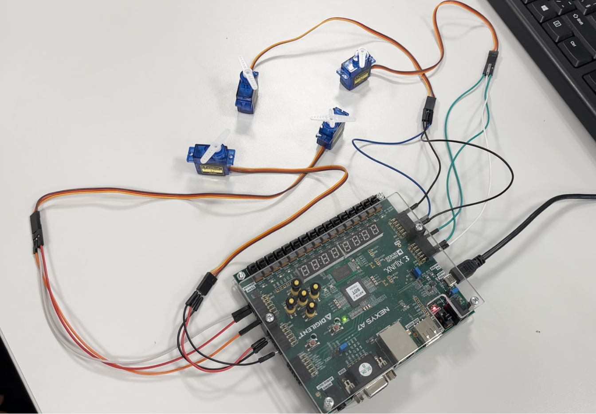
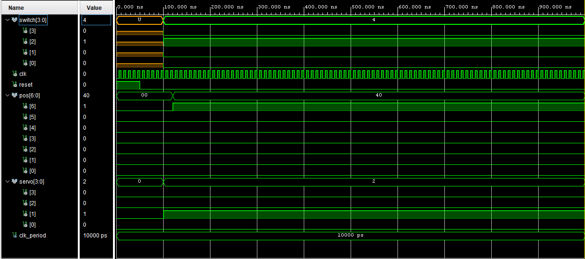

<h1 align="center">Topic 3: PWM-Based Servo Motor Controller</h1>

<h2>Project description</h2>

Develop a PWM-based servo motor controller using VHDL on the Nexys A7 FPGA board. Utilize the FPGA's PWM output capability to generate signals for controlling multiple independent servo motors connected to the Pmod connectors. Implement algorithms to adjust the angle of the servo motors based on user input received from buttons or switches. LEDs will offer visual feedback on the servo position or controller status.

    <h2>Team members and roles</h2>
    
Karol Nový - Video, Coding Martin Matyska - Coding, Documentation Marek Michalica - Hardware, Documentation

    <h1>Our take on the problem</h1>
    
Our approach to addressing the project involves employing a system where four switches are designated for selecting a specific servo motor, while another set of seven switches determines the angle for the selected servo. As a servo motor is chosen, its corresponding LED lights up, providing visual confirmation of the selection. Simultaneously, LEDs associated with the selected angle switches illuminate to indicate the desired position. Leveraging the PWM signal generated by our code, we dynamically control the servo motors, ensuring precise movement according to the selected angle. This design not only allows for intuitive selection and adjustment of servo motors and angles but also offers real-time visual feedback, enhancing user interaction and system monitoring.

    <h1>Theory overview</h1>
    <h3>Pulse Width Modulation (PWM)</h3>
    

        Pulse-width modulation (PWM), a widely-used modulation technique, involves altering the width of pulse signals within electrical systems to regulate the average power delivered to a load. This method proves particularly advantageous in controlling the output of audio amplifiers, motor speeds, and light brightness effectively. Essentially, PWM serves as a concise reference to a specific type of digital signal, finding diverse applications in complex control circuits.
        By allowing adjustment of signal duration in an analog manner, PWM facilitates a spectrum of effects across various applications. Despite the signal's binary nature—either high (often 5V) or low (ground) at any given moment—the ratio of high to low signal durations can be manipulated over regular intervals. In today's electronics landscape, PWM remains pivotal as technology evolves, frequently integrated into microcontrollers and specialized PWM controller integrated circuits (ICs) for ease of implementation. Its versatility and efficacy render it a fundamental element in designing and managing a wide array of electronic systems, contributing significantly to advancements in power electronics and control engineering.
    

     
    

        
         
        
Figure 1: Pulse Width Modulation (PWM)

    

    <h1>Hardware</h1>
    

        Utilizing the Nexys A7 FPGA board as mandated by the project requirements, we integrated four SG90 9g servo motors into our system, connecting them to the board's Pmod ports (JA, JB, JC, JD). Technical specifications for both the servos and the FPGA board are detailed in the accompanying datasheets.
        Servo selection is made possible by switches SW12 to SW15, while angle selection utilizes switches SW0 to SW6. The BTNR button allows for PWM signal interruption when required.
        For user convenience and system monitoring, each activated switch illuminates its corresponding LED diode, aiding intuitive operation during servo and angle selection.
         
        When considering that we have 7 switches (128 positions) and a modulation range of 2 ms, we obtain the frequency for our clock signal using the following equation: f=1/(2ms/128)=64kHz. With a frequency of 64kHz, we will have 1 ms every 64 repetitions, and for a frequency of 20 ms, we simply multiply by 20 (20*64=1280). The value of 1280 will be used for the internal counter to ensure a period of 20 ms.
    

    

        
        
Figure 2: Nexys A7-50T FPGA board

        
        
Figure 3: The circuit for connecting 4 SG90 9g servo motors to Nexys A7-50T FPGA board

    

    <h1>Software</h1>
    

        
        
Figure 4: Elaborated design for top level

    

    <h2>Source files</h2>
    

        <a href="https://github.com/MarekMichalica/DE1_Servo_Controller/blob/main/PWM_Servo.srcs/sources_1/new/clk64kHz.vhd">clock64kHz.vhd</a>
        

            This module functions as a clock frequency divider, generating a 64 kHz clock signal from an input clock. It takes in a main clock signal <b>clk</b>, a reset signal <b>reset</b>, and outputs the generated 64 kHz clock signal <b>clk_out</b>. Inside, 
            it toggles the output signal every 780 clock cycles, effectively dividing the input frequency to 64 kHz. This module facilitates precise timing control for applications requiring a 64 kHz clock signal.
        

    

    

        <a href="https://github.com/MarekMichalica/DE1_Servo_Controller/blob/main/PWM_Servo.srcs/sources_1/new/servo_pwm.vhd">servo_pwm.vhd</a>
        

            This module serves as a controller for a servo motor using pulse-width modulation (PWM). It takes in a clock signal <b>clk</b>, a reset signal <b>reset</b>, and a 7-bit vector <b>pos</b> representing the desired position of the servo motor. The module generates a PWM output signal <b>servo</b> to control the servo motor. It utilizes an internal counter <b>cnt</b> to track clock cycles and calculates a PWM pulse width <b>pwmi</b> based on the input position. The servo output signal is set to 1 when the counter
            is less than the PWM pulse width, indicating the ON state of the PWM signal, and 0 otherwise. This allows precise control over the servo motor's position based on the input position value.
        

    

    

        <a href="https://github.com/MarekMichalica/DE1_Servo_Controller/blob/main/PWM_Servo.srcs/sources_1/new/top_level.vhd">top_level.vhd</a>
        

            This model functions as an integration of servo motor control and clock frequency division. It combines the functionalities of two VHDL components: <b>clk64kHz</b>, responsible for generating a 64 kHz clock signal from the input clock, and <b>servo_pwm</b>, managing servo motor control through pulse-width modulation (<b>PWM</b>). Inputs include the main clock signal <b>clk</b>, a reset signal <b>reset</b>, a 4-bit switch vector <b>sw</b>, and a 7-bit vector <b>pos</b> representing the servo motor position. Outputs consist of a 4-bit LED vector <b>LED</b> used by the servos, a 7-bit LED vector <b>LED_P</b> used by angle switches, and a 4-bit servo control vector <b>servo_t</b>. The model maps the clock signal to <b>clk64kHz</b> and utilizes the resultant clock signal to drive <b>servo_pwm</b>. 
            LED outputs reflect the switch values and servo motor position, facilitating visual feedback. Additionally, servo control signals are generated based on switch values, enabling individual servo motor manipulation.
        

    

    <h2>Testbench files</h2>
    

        <a href="https://github.com/MarekMichalica/DE1_Servo_Controller/blob/main/PWM_Servo.srcs/sim_1/new/servo_pwm_clk64kHz_tb.vhd">servo_pwm_clk64kHz_tb.vhd</a>
        

            This testbench, named <b>servo_pwm_clk64kHz_tb</b>, is designed to verify the functionality of the <b>servo_pwm_clk64kHz</b> module. The Unit under test (UUT) is instantiated within this architecture. The <b>UUT</b> combines servo motor control and clock frequency division features. Inputs to the testbench include the clock signal (<b>clk</b>), reset signal (<b>reset</b>), a 4-bit switch vector (<b>switch</b>), and a 7-bit vector indicating the servo motor position (<b>pos</b>). Outputs consist of a 4-bit servo control vector (<b>servo</b>). The clock signal operates with a period of 10 ns. The testbench includes processes to generate clock signals and stimuli. The clock process generates a clock signal with a 50% duty cycle. 
            The stimuli process initializes the reset signal, alters switch values, and adjusts the servo motor position, simulating various scenarios to validate the module's functionality.
            During the simulation conducted by the testbench, the <b>SW14 switch</b> is activated to choose servo 2, and the servo angle is configured to 90 degrees using the pos(6) signal. This setup aims to evaluate the servo motor control specifically for servo 2, ensuring its proper operation at a predefined angle.
        

        

            
            
Figure 5: Testbench for clk64kHz and servo_pwm modules

        

        
    

    <h2>Constraints</h2>
    

        <a href="https://github.com/MarekMichalica/DE1_Servo_Controller/blob/main/PWM_Servo.srcs/constrs_1/new/nexys_A7_50T.xdc">nexys_A7_50T.xdc</a>
        
This module contains necessary constraints for connecting to physical pins on the Nexys A7-50T FPGA board."

    

    <h1>Instructions and video demonstration</h1>

    <h2>Instructions</h2>
    <h3>Selecting Servo Motor</h3>
    

        To designate the target servo motor for manipulation, toggle the corresponding switch among SW15 to SW12. Each switch correlates to a specific servo motor, with SW15 representing the first servo at the JA Pmod port, SW14 indicating the second servo at JB Pmod port and so forth. This selection process ensures precise control over the servo to be adjusted.
    

    <h3>Setting Angle</h3>
    

        When a switch within the SW6 to SW0 range is flipped, the connected servo motor instantly adjusts to the configured angle. Each switch corresponds directly to a specific angle setting: flipping SW6 sets the angle to 90 degrees, SW5 to 45 degrees, SW4 to half of that, and so forth. This immediate adjustment enables users to precisely control the servo motor's position with ease and accuracy.
    

    <h3>Combining Angles</h3>
    

        To create complex angle combinations, simultaneously toggle multiple switches within the SW6 to SW0 range. Each flipped switch contributes its angle to the total, instantly adjusting the selected servo motor accordingly. For example, activating SW6, SW5, and SW3 simultaneously instantly adds their respective angles, resulting in a combined angle for precise servo positioning.
    

    <h3>Observing LED Feedback</h3>
    

        Throughout the process, LED indicators offer valuable feedback on the system's current status and the selected servo motor. By monitoring these indicators, users can easily discern which servo motor is active and whether an angle setting is in progress, ensuring efficient and informed operation of the servo control system.
    

<h2>Video demonstration</h2>

https://github.com/MarekMichalica/DE1_Servo_Controller/assets/66474721/2c78debe-008c-4e1d-b04f-1390e239a62a

    <h1>References</h1>
    

    [1] https://www.vorpenergy.com/batteries/pwm-solar-charge-controllers/
     
    [2] http://www.ee.ic.ac.uk/pcheung/teaching/DE1_EE/stores/sg90_datasheet.pdf
     
    [3] https://digilent.com/reference/programmable-logic/nexys-a7/start
     
    [4] https://www.codeproject.com/Articles/513169/Servomotor-Control-with-PWM-and-VHDL
     
    [5] https://www.jameco.com/Jameco/workshop/Howitworks/how-servo-motors-work.html
     
    [6] https://electronics.stackexchange.com/questions/346603/driving-servo-motor-with-pwm-signal
     
    [7] https://en.wikipedia.org/wiki/Pulse-width_modulation
    

